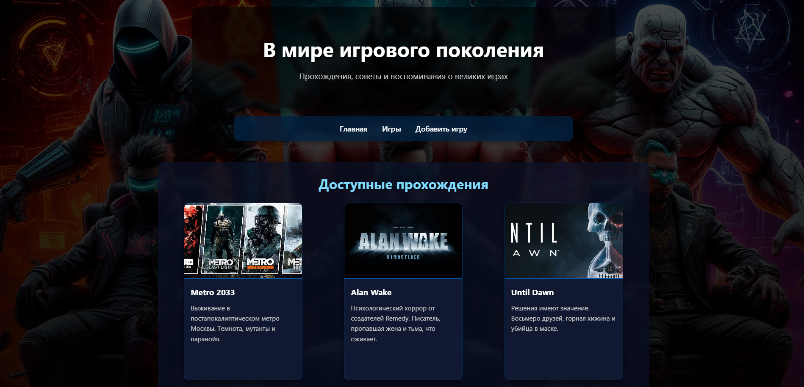

# 🌍 В мире игрового поколения

Сайт-гайд по видеоиграм, созданный на **Flask (Python)** - Находится на стадии разработки.
Позволяет просматривать прохождения, добавлять новые игры и редактировать гайды прямо в браузере — **без перезапуска сервера и без базы данных**.



---

## 🎯 Функционал

- 🏠 Главная страница с описанием и контактами
- 📚 Список игр с обложками
- 📖 Подробные гайды по прохождению
- ➕ Добавление своих игр
- ✏️ Редактирование **любой игры** (включая оригинальные)
- 💾 Автосохранение в `JSON` (не теряется при перезапуске)
- 🖼 Красивый фон и адаптивный дизайн
- 🔗 Простая навигация

---

## 🛠 Технологии

- **Python 3.7+**
- **Flask** — веб-фреймворк
- **Jinja2** — шаблоны
- **HTML/CSS** — вёрстка (без JS)
- **JSON** — временное хранилище данных

---

## 🚀 Установка и запуск

### 1. Клонируй репозиторий
```bash
    git clone https://github.com/DrVizual/Flask_Game-World
    cd Flask_Game-World
```
### 2. Установи зависимости

```bash
    pip install flask python-dotenv
```

### 3. Запусти сервер
```bash
    flask run
```